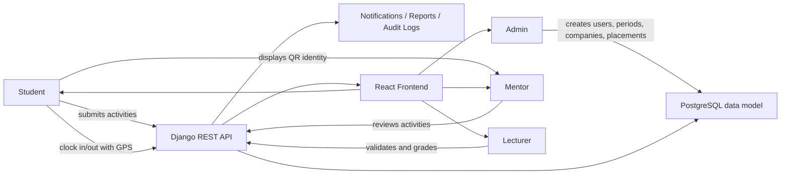

# Internship Logging and Evaluation System (ILES)

ILES is a full-stack internship management platform for coordinating students, field mentors, lecturers, and administrators during an internship period. The repository contains a React frontend in `frontend/` and a Django REST backend in `backend/`.

The system is built around four core goals:

- manage internship placements and supervision relationships
- capture daily student activity and attendance
- support validation and grading workflows
- generate reports and audit-friendly records

## Project Team

| Name | Student Number | Registration Number |
| --- | --- | --- |
| Okuja Emmanuel Dila John | 2500728777 | 25/U/28777/PSA |
| Asiimwe Nicole Praise | 2500703337 | 25/U/03337/PS |
| Nanfuka Justine | 2500703528 | 25/U/03528/PS |
| Wasswa Kateregga Maurice | 2500703613 | 25/U/03613/PSA |

## Repository Layout

```text
ILES GROUP PROJECT/
|-- backend/   Django + Django REST Framework API
`-- frontend/  React + Vite client application
```

## Technology Stack

### Frontend

- React 19
- React Router
- Axios
- QR code generation with `qrcode`
- Vite

### Backend

- Django 5
- Django REST Framework
- Simple JWT authentication
- PostgreSQL-oriented data model
- `django-filter` for filtering
- `drf-spectacular` for schema and Swagger docs
- Redis/Celery hooks for async-capable architecture

## What the System Does

The platform models the internship lifecycle from account creation to placement, attendance, activity validation, lecturer evaluation, and reporting.

At a high level:

1. Users authenticate and enter the platform according to role.
2. Admins or academic staff define companies, internship periods, and placements.
3. Students submit daily logbook activities and clock attendance.
4. Mentors review student work and validate or reject activity submissions.
5. Lecturers perform final academic approval and scoring.
6. Reports and audit logs summarize what happened across the internship.

## Main Stakeholders

### Student

The student is the primary data producer in the system.

The student can:

- sign up and log in
- view placement and internship status
- submit daily activity log entries
- clock in and clock out for attendance
- view GPS-captured attendance history
- view notifications from mentor and lecturer actions
- view lecturer evaluation scores
- download personal reports
- display a personal QR code for identity verification

### Field Mentor

The field mentor supervises students at the host organization.

The mentor can:

- view assigned mentees
- review pending activity submissions
- approve an activity and forward it to the lecturer
- reject an activity and return it to the student with a note
- create activities for a student when needed
- view attendance records for supervised students
- open the QR scanner interface for student verification
- download mentor-facing reports

### Lecturer

The lecturer is the academic supervisor responsible for final validation and grading.

The lecturer can:

- view students under their supervision
- review mentor-approved activities
- perform final approval of activity log entries
- reject or return activity entries with lecturer notes
- create and update student evaluations
- inspect attendance and cohort-level progress
- generate cohort, attendance, activity, and evaluation reports

### Administrator

The administrator manages the platform configuration and master data.

The admin can:

- manage users across all roles
- create and manage companies
- create internship periods
- assign placements linking student, company, mentor, lecturer, and period
- access broad reporting and audit records

## How the Stakeholders Interact

The system works because each role contributes a different kind of data and approval:

- The admin creates the operational structure: users, companies, periods, and placements.
- A placement connects one student to one company, one mentor, one lecturer, and one internship period.
- The student records daily work through activity logs and attendance events.
- The mentor performs workplace-side review of student activity.
- The lecturer performs academic-side validation and scoring.
- Notifications and audit logs keep everyone aligned on what changed and when.

## Core Business Flow

### 1. Authentication and role routing

Users authenticate through JWT-based endpoints under `/api/v1/auth/*`. After login, the frontend routes users to the correct dashboard based on role:

- `student`
- `mentor`
- `lecturer`
- `admin`

### 2. Placement creation

The placement is the central relationship in the platform. A placement records:

- student
- company
- lecturer
- mentor
- internship period
- creator

Once a placement exists, most supervision, attendance, and reporting become role-aware because attendance and activity records can be tied back to that placement.

### 3. Student activity logging

Students submit daily activity log entries using the frontend dashboard. Each activity contains fields such as:

- title
- description
- skills applied
- hours spent
- activity date
- student
- optional mentor linkage
- placement linkage when available

The activity status moves through a staged workflow:

`pending -> mentor_approved -> validated`

An activity can also be `rejected`.

This means:

- students submit or edit entries
- mentors review workplace relevance and authenticity
- lecturers give final academic validation

### 4. Attendance tracking with GPS

Attendance is persisted in the backend through `AttendanceRecord`.

For each attendance record, the database stores:

- student
- placement
- record date
- clock-in time
- clock-out time
- latitude
- longitude
- attendance status

When a student clicks `Clock In (GPS)` in the frontend:

1. the browser asks for geolocation permission
2. the frontend reads latitude and longitude from `navigator.geolocation`
3. the frontend sends those coordinates to `POST /api/v1/attendance/clock-in/`
4. the Django backend creates the day's attendance record
5. the record is linked to the student's placement where available
6. an audit log entry is created

If geolocation fails, the frontend still attempts clock-in with `null` coordinates, so attendance can still be recorded even when the device cannot provide GPS data.

When the student clocks out:

1. the frontend calls `POST /api/v1/attendance/clock-out/`
2. the backend finds today's attendance row
3. the backend saves `clock_out_at`
4. an audit log entry is created

### 5. Mentor validation

Mentors see activities for students attached to their placements. From there they can:

- validate an activity using the mentor validation endpoint
- reject it with a mentor note

Approving an activity changes the status to `mentor_approved` and triggers a notification to the student. Rejecting an activity returns it to the student and also notifies them.

### 6. Lecturer approval and evaluation

Lecturers receive activities that have already passed mentor review. They can:

- approve the activity for final validation
- reject or return it with a lecturer note
- create or update formal evaluations

Evaluations store academic scoring dimensions such as:

- skills
- professionalism
- development
- deliverables

The frontend computes and displays a weighted total to the student, while the backend stores the component scores and exposes them through the evaluation API.

### 7. Notifications and reports

Notifications are created when major workflow events happen, for example:

- placement assignment
- mentor approval
- mentor rejection
- lecturer approval
- lecturer rejection
- evaluation updates

Reports are generated from backend data and can summarize:

- placements
- attendance
- validation/activity flow
- cohort progress
- evaluations
- audit activity

## Database Model Overview

The backend data model is centered around these main entities:

- `User`: all authenticated users with role-based access
- `StudentProfile`: student-specific academic metadata
- `Company`: internship host organization
- `InternshipPeriod`: academic internship window
- `Placement`: ties a student to a company, mentor, lecturer, and period
- `ActivityLog`: student daily work entries and approval state
- `AttendanceRecord`: daily attendance with time and location data
- `Evaluation`: lecturer scoring for a student in a period
- `Notification`: user-facing workflow alerts
- `AuditLog`: trace of important system actions

### Relationship summary

- one student has one `StudentProfile`
- one student can have placements across periods
- one placement belongs to one company, one mentor, one lecturer, and one period
- one student can create many activities
- one placement can have many attendance records and many activities
- one lecturer can evaluate many students

## API Overview

The backend exposes its main REST API under `/api/v1/`.

Key groups:

- `/api/v1/auth/`
- `/api/v1/users/`
- `/api/v1/companies/`
- `/api/v1/periods/`
- `/api/v1/placements/`
- `/api/v1/activities/`
- `/api/v1/attendance/`
- `/api/v1/evaluations/`
- `/api/v1/notifications/`
- `/api/v1/reports/`
- `/api/v1/audit-logs/`

Useful platform endpoints:

- `/health/` for service health
- `/api/schema/` for OpenAPI schema
- `/api/docs/` for Swagger UI

## How GPS, QR, API, and Database Work Together

### GPS attendance flow

The GPS feature is already integrated end-to-end.

- Actor: Student
- Frontend source: student dashboard attendance page
- Browser capability: geolocation API
- Backend endpoint: `POST /api/v1/attendance/clock-in/`
- Database target: `AttendanceRecord.latitude` and `AttendanceRecord.longitude`

This is a full client -> API -> database flow.

### QR code flow

The QR flow currently works mainly as an identity-verification interface on the frontend.

What exists today:

- the student dashboard generates a QR code in the browser
- the encoded QR payload currently includes the student's `id`, `name`, and role
- the mentor dashboard includes a camera-based scanner screen
- the mentor scanner currently demonstrates the verification interaction in the UI and can simulate a successful scan

What this means architecturally:

- QR generation happens in the frontend
- the student QR represents identity information, not a direct database write
- the current mentor scanner flow is not yet persisting scan events to the Django backend
- the database and API currently have strong support for attendance, activities, placements, evaluations, notifications, and reports, but not a dedicated QR-scan persistence model yet

So in the current implementation:

- GPS attendance is a persisted workflow
- QR verification is a presentational and identity layer that can be extended into a persisted verification workflow later

## Interaction Diagram



## Current Strength of the Implementation

The project is strongest today in these areas:

- role-based internship workflow
- placement and supervision structure
- GPS-backed attendance capture
- mentor and lecturer approval pipeline
- evaluation and reporting surfaces
- notification and audit logging support

## Important Implementation Note

The README intentionally reflects the project as it exists now:

- GPS attendance is integrated with the API and database
- QR is integrated in the frontend experience but is not yet modeled as a dedicated persisted backend workflow

That distinction matters when explaining the system to supervisors, examiners, or future developers.

## Deployment Guide

The recommended production setup for this project is:

- `frontend/` deployed as a Vercel frontend project
- `backend/` deployed as a separate Vercel Python project
- PostgreSQL hosted on Neon

### Recommended deployment order

1. Create the Neon database project.
2. Collect the production database connection values.
3. Create the Vercel backend project from `backend/`.
4. Add backend environment variables.
5. Deploy the backend.
6. Run Django migrations against production.
7. Verify backend endpoints such as `/health/` and `/api/docs/`.
8. Create the Vercel frontend project from `frontend/`.
9. Set the frontend API base URL to the deployed backend.
10. Deploy the frontend and run end-to-end checks.

### Backend production environment variables

Use these variables for the Vercel backend project:

```env
DJANGO_SETTINGS_MODULE=config.settings.prod
DJANGO_SECRET_KEY=generate-a-long-random-secret
DJANGO_DEBUG=False
DJANGO_ALLOWED_HOSTS=your-backend-project.vercel.app
DJANGO_TIME_ZONE=Africa/Kampala

POSTGRES_DB=neondb
POSTGRES_USER=your_neon_user
POSTGRES_PASSWORD=your_neon_password
POSTGRES_HOST=your-neon-host
POSTGRES_PORT=5432
POSTGRES_SSLMODE=require
POSTGRES_CONN_MAX_AGE=60

CORS_ALLOWED_ORIGINS=https://your-frontend-project.vercel.app
CSRF_TRUSTED_ORIGINS=https://your-frontend-project.vercel.app

DJANGO_LOG_LEVEL=INFO
APP_LOG_LEVEL=INFO
```

Optional variables if background services are introduced later:

```env
REDIS_URL=
CELERY_BROKER_URL=
CELERY_RESULT_BACKEND=
```

### Frontend production environment variables

Use this variable for the Vercel frontend project:

```env
VITE_API_URL=https://your-backend-project.vercel.app/api/v1
```

### Production readiness notes

- Use Neon SSL in production with `POSTGRES_SSLMODE=require`.
- Keep `DJANGO_DEBUG=False` in production.
- Set `DJANGO_ALLOWED_HOSTS`, `CORS_ALLOWED_ORIGINS`, and `CSRF_TRUSTED_ORIGINS` to the real Vercel domains.
- Vercel is a strong fit for the frontend and request-response Django API.
- If you later depend heavily on Celery workers, long-running background jobs, or persistent file storage, you may want to keep the frontend on Vercel and move those backend workloads to a platform built for persistent workers.
